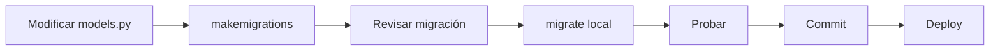

# Guía de Solución: Error de Migración `documents_document_sdgs` en Producción

**Versión:** 1.0  
**Fecha:** 21 de Octubre, 2025  
**Estado:** Resuelto

---

## 📋 Tabla de Contenidos

1. [Resumen del Problema](#resumen-del-problema)
2. [Causa Raíz](#causa-raíz)
3. [Solución Implementada](#solución-implementada)
4. [Guía de Deployment](#guía-de-deployment)
5. [Verificación Post-Deployment](#verificación-post-deployment)
6. [Prevención Futura](#prevención-futura)

---

## 🔍 Resumen del Problema

### Error Observado

```
psycopg2.errors.DuplicateTable: relation "documents_document_sdgs" already exists
```

### Síntomas

- El contenedor `spider_web` falla al iniciar en producción
- Las migraciones fallan con error `ProgrammingError`
- La tabla `documents_document_sdgs` existe en la base de datos pero Django intenta crearla nuevamente

---

## 🔎 Causa Raíz

El problema ocurrió debido a una **desincronización entre el estado real de la base de datos y el registro de migraciones de Django**:

1. **Migración creada manualmente**: La migración `0010_documentsdg_alter_document_sdgs_and_more.py` fue creada manualmente (por IA/Cursor) sin usar `python manage.py makemigrations`

2. **Tabla existente**: La tabla `documents_document_sdgs` ya existía en la base de datos de producción

3. **Registro faltante**: Django no tenía registrado que la migración 0010 ya estaba "aplicada"

4. **Conflicto al desplegar**: Al desplegar, Django intentó ejecutar la migración 0010, que intentaba crear una tabla que ya existía

---

## ✅ Solución Implementada

### 1. Regeneración de Migraciones

Las migraciones problemáticas fueron **eliminadas y regeneradas correctamente** usando el proceso estándar de Django:

```bash
# 1. Backup de migraciones antiguas (automático)
apps/documents/migrations/0010_*.py.backup
apps/documents/migrations/0011_*.py.backup

# 2. Regeneración usando makemigrations
poetry run python manage.py makemigrations documents
```

### 2. Migración Resiliente

La nueva migración `0010` fue modificada para ser **resiliente** y funcionar en todos los escenarios:

- ✅ **Entornos nuevos**: Crea la tabla si no existe
- ✅ **Producción existente**: No falla si la tabla ya existe
- ✅ **Constraints e índices**: Se agregan solo si no existen

**Características clave:**

```python
# Usa CREATE TABLE IF NOT EXISTS
CREATE TABLE IF NOT EXISTS documents_document_sdgs (...)

# Verifica constraints antes de agregarlas
IF NOT EXISTS (SELECT 1 FROM pg_constraint WHERE ...)

# Crea índices solo si no existen
CREATE INDEX IF NOT EXISTS doc_sdg_search_vector_gin ...
```

### 3. Scripts de Sincronización

Se crearon scripts automatizados para facilitar la sincronización en producción:

- `scripts/fix_production_migrations.py` - Script Python principal
- `scripts/fix_production_migrations.ps1` - Wrapper para Windows/PowerShell
- `scripts/fix_production_migrations.sh` - Wrapper para Linux/Mac

---

## 🚀 Guía de Deployment

### Opción 1: Deployment Limpio (Recomendado)

Esta opción reconstruye el contenedor con la migración corregida:

```powershell
# 1. Detener contenedores
docker-compose down

# 2. Reconstruir la imagen
docker-compose build spider_web

# 3. Iniciar servicios
docker-compose up -d

# 4. Verificar logs
docker-compose logs -f spider_web
```

**Ventajas:**
- ✅ Solución limpia y permanente
- ✅ No requiere intervención manual
- ✅ La migración resiliente se encarga de todo

**Desventajas:**
- ⏱️ Requiere tiempo de rebuild (~2-5 minutos)

---

### Opción 2: Sincronización Manual (Más Rápida)

Si prefieres no reconstruir, usa el script de sincronización:

```powershell
# Ejecutar el script de sincronización
.\scripts\fix_production_migrations.ps1
```

El script detectará automáticamente la situación y:
1. Verificará si la tabla existe
2. Verificará si la migración está registrada
3. Marcará la migración como aplicada si es necesario
4. Limpiará registros obsoletos

**Después de ejecutar el script:**

```powershell
# Reiniciar el contenedor
docker-compose restart spider_web
```

**Ventajas:**
- ✅ Más rápido (~30 segundos)
- ✅ No requiere rebuild

**Desventajas:**
- ⚠️ Requiere acceso directo a la base de datos
- ⚠️ Menos elegante que la Opción 1

---

### Opción 3: Comando Manual (Para Emergencias)

Si necesitas resolver el problema inmediatamente sin scripts:

```bash
# 1. Conectar al contenedor
docker exec -it spider_web bash

# 2. Marcar la migración como aplicada (fake)
python manage.py migrate documents 0010 --fake

# 3. Salir y reiniciar
exit
docker-compose restart spider_web
```

---

## ✔️ Verificación Post-Deployment

Después de aplicar cualquiera de las opciones, verifica:

### 1. Verificar que el contenedor está corriendo

```powershell
docker-compose ps
```

**Esperado:** `spider_web` debe estar en estado `Up (healthy)`

### 2. Verificar migraciones

```powershell
docker-compose exec spider_web python manage.py showmigrations documents
```

**Esperado:** Todas las migraciones deben tener `[X]`

```
documents
 [X] 0001_initial
 [X] 0002_city_country_remove_document_city_and_more
 ...
 [X] 0009_alter_document_admin_notes_alter_document_title
 [X] 0010_documentsdg_alter_document_sdgs_and_more
```

### 3. Verificar la tabla

```powershell
docker-compose exec spider_db psql -U spiderhub -d spiderhub_db -c "\d documents_document_sdgs"
```

**Esperado:** Descripción de la tabla con todas las columnas

### 4. Verificar logs

```powershell
docker-compose logs --tail=50 spider_web
```

**Esperado:** No debe haber errores de migración

---

## 🛡️ Prevención Futura

Para evitar este problema en el futuro:

### 1. **SIEMPRE usar `makemigrations`**

❌ **NO hacer:**
```python
# Crear migraciones manualmente
# Copiar/pegar migraciones
# Dejar que IA cree migraciones desde cero
```

✅ **SÍ hacer:**
```bash
# Modificar models.py primero
poetry run python manage.py makemigrations

# Revisar la migración generada
# Aplicar localmente
poetry run python manage.py migrate

# Probar que funciona
# Luego hacer commit
```

### 2. **Workflow correcto de migraciones**



### 3. **Testing de migraciones**

Antes de desplegar a producción:

```bash
# 1. Probar en base de datos limpia
poetry run python manage.py migrate --database=test

# 2. Probar rollback
poetry run python manage.py migrate documents 0009
poetry run python manage.py migrate documents 0010

# 3. Verificar que no hay errores
poetry run python manage.py migrate --check
```

### 4. **Migraciones resilientes para casos especiales**

Si necesitas crear una migración que modifica una tabla que podría existir:

```python
# Usar RunSQL con IF EXISTS / IF NOT EXISTS
migrations.RunSQL(
    sql="ALTER TABLE ... ADD COLUMN IF NOT EXISTS ...",
    reverse_sql="ALTER TABLE ... DROP COLUMN IF EXISTS ..."
)
```

### 5. **Documentación de cambios**

Cuando se crea una migración que modifica estructura existente:

1. ✅ Documentar en el commit message
2. ✅ Actualizar esta guía si es necesario
3. ✅ Notificar al equipo antes de desplegar
4. ✅ Hacer backup de producción antes de cambios grandes

---

## 📚 Referencias Relacionadas

- [Django Migrations Documentation](https://docs.djangoproject.com/en/stable/topics/migrations/)
- [PostgreSQL CREATE TABLE IF NOT EXISTS](https://www.postgresql.org/docs/current/sql-createtable.html)
- [Django Migration Operations](https://docs.djangoproject.com/en/stable/ref/migration-operations/)

---

## 📝 Historial de Cambios

| Versión | Fecha | Descripción |
|---------|-------|-------------|
| 1.0 | 2025-10-21 | Documento inicial - Solución de error de migración |

---

## 🤝 Soporte

Si encuentras problemas adicionales relacionados con migraciones:

1. Revisar logs: `docker-compose logs spider_web`
2. Verificar estado de BD: `docker-compose exec spider_db psql ...`
3. Ejecutar script de diagnóstico: `.\scripts\fix_production_migrations.ps1`
4. Consultar este documento
5. Contactar al equipo de desarrollo

---

**Fin del documento**

